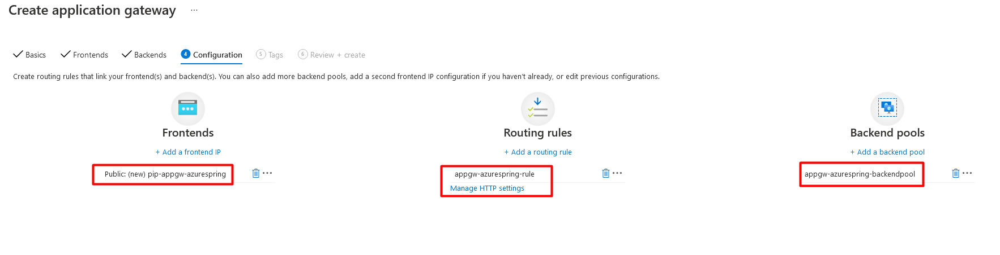

## Application Gateway with single Backend pool, routing rule, Listener and HTTP Settings.
For the sake of simplicity, this example uses a simple setup with a public front-end IP, a multi site listener to host a single site on this application gateway, an App service (function app) used for the backend pool, and a Path-Based request routing rule.

1. Let's start creating **Application Gateway**. Notice the Tier which is set to "Standard V2". For WAF policy to work with Application Gateway, we need to set the Tier as WAF V2

2. Create VNET and Subnet

3. Frontend is the IP address public or private. Every request will receive on this frontend and then proceed for further operations. Verify it's type is set to **Public**.

**Note**: For the Application Gateway v2 SKU, you can only choose Public frontend IP configuration. Private frontend IP configuration is currently not enabled for this v2 SKU.

4. Click on "**Add a backend pool**" to add backend

5. Backend pool is used to route requests to the the backend servers whether it is Virtual machine or App service. Target type could be Virtual Machines, Virtual Machine scale set, IP address or FQDN (fully qualified domain name) or APP service. In this example, it will an App Service which is a function application.

6. Next is to add routing rule. Click on + (plus) icon.

7. A routing rule requires a listener. We can configure Listener within the **Add routing rule** as shown in **Figure 7**. This listener will be the entry point for all request coming from Internet. It will listen on **Host name** which is azurespring-demo.acloudtechie.com .

8. The HTTP setting will determine the behaviour of the routing rule. Configure HTTP setting and make sure the radio button "**Pick host name from backend target**" is selected. Since we've set **App Service** as Target type in backend pool so this HTTP setting will pick the host name from function app which is https://aspw-golangfunc-aen-nonprod.azurewebsites.net in this example.

9. This rule will be based on Path-Based which means "*" (wildcard) will be added here so it can support all APIs as the URL path. for example:
   - **/api/foo**
   - **/api/bar**
   - **/api/baroof**

10. Our configuration is completed so next is to validate the configurations and all the steps.

11. Validate, Review + Create

