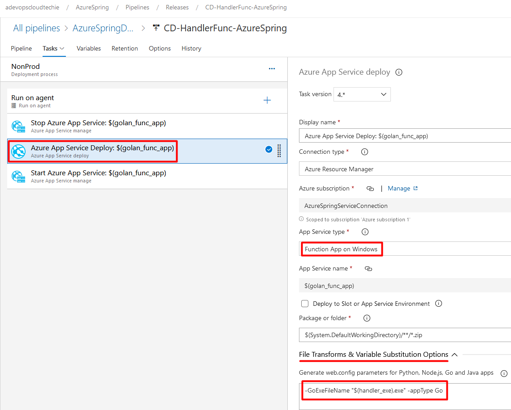

## Setup Build and Release Pipeline to deploy code
In this example, our goal is to deploy *Azure function* written in golang.

**Custom Handler** feature has been generally available since late 2020 so we will be using the same custom handler to develop Azure functions written in golang.

[goazurefun](https://github.com/zeeshanmcp12/goazurefun) repo is used to host functions written in golang. We have three very basic functions that returns string and one of them a JSON data. These are the three functions:
- /getname
- /greetings
- /getprofile

We will host all three functions in single Function app and deploy it using build and release pipeline.

---
### Setup Build Pipeline

1. This task is used to install go version on pipeline agent.
   

2. This task will be running *go get* and download the packages along with their dependencies.

3. This task will run *go build* command which compiles the packages and their dependencies in a single executable file.

4. Next we use the *Archive Files* task to create an archive file from a source folder.

5. Finally, we use the *Publish Build Artifacts* task to publish build artifact to DevOps pipelines.

---
### Setup Release Pipeline

1. Create Release pipeline and add artifacts. In this example, it is **_CI-HandlerFunc-AzureSpring**

2. Add Azure App service manage task which will stop the function app.

3. Add Azure App service deploy task that will deploy the code from publised artifact to Azure function app.

4. Add Azure App service manage task which will start the function app again once the deployment is completed.

5. In previous tasks, we used $(golang_func_app) variable in many places. It's value is defined in variables section.

6. Once everything is configured then execute the deployment and see the results.

---

## Thank You
Thank you for reading!

Follow me for more content at https://acloudtechie.com
Let's Grow together! 