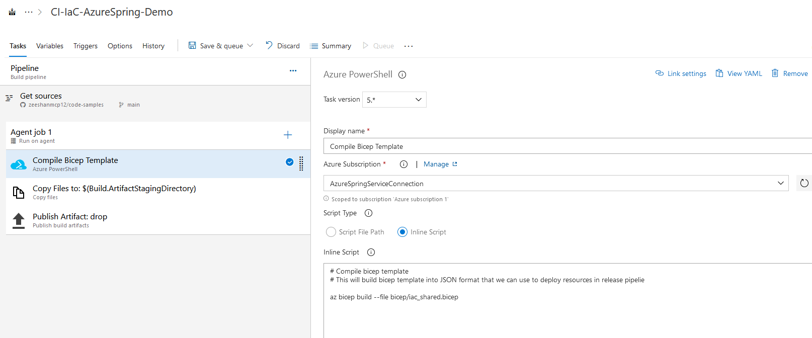
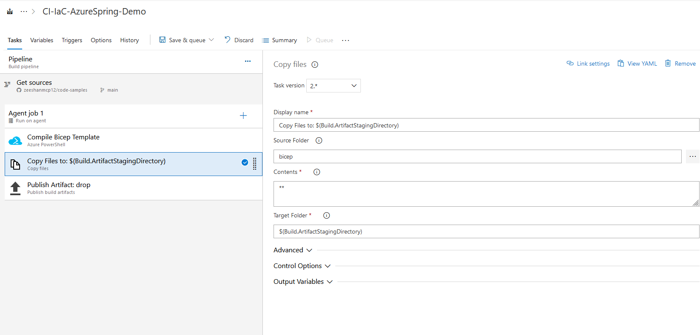
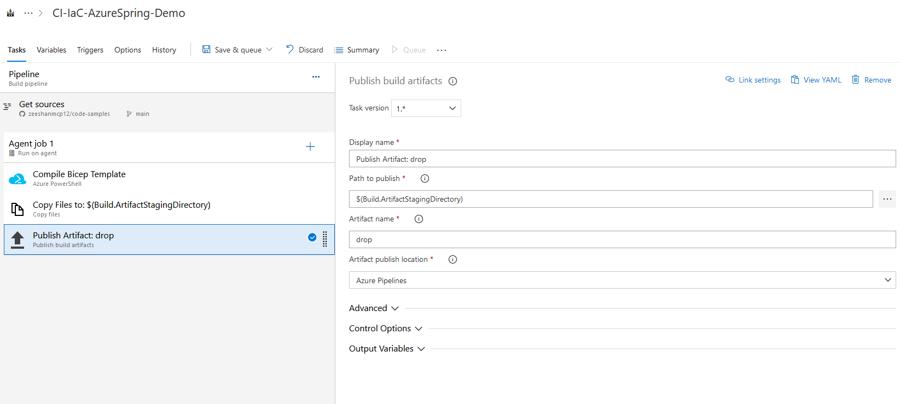
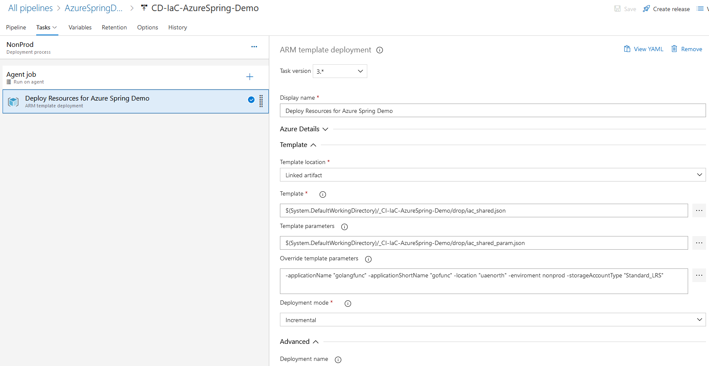
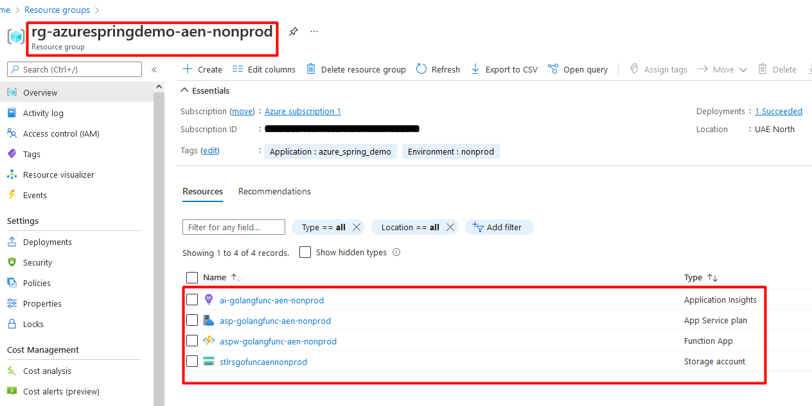

## Setup Build and Release pipelines to provision infrastructre
Working for "**Geo-restrict web application using WAF and Application gateway**" requires some resources to be provision on Azure. In this example, we are going to provision following resources in order to support this blog post:
- App service (Function Application)
- App service plan (consumption based)
- Storage account
- Application insights

[iac_shared.bicep](/setup-cicd-to-provision-infrastructure/iac_shared.bicep) contains following resources:
- App service (Function Application - windows)
- App service plan (consumption based)
- Storage account
- Application insights

[iac_shared_param.json](/setup-cicd-to-provision-infrastructure/iac_shared_param.json) is used to host parameter values that we are using in release pipeline. We can also override these parameters in release pipelines.

  
---
### Setup Build Pipeline
Let's create a build pipeline which will compile bicep templates and transform into JSON format.

1. Compile Bicep files using inline script in Azure PowerShell task
   

2. Copy files to Build.ArtifactStagingDirectory.

3. Publish files to Build.ArtifactStagingDirectory so we can use it in release pipeline.

---
### Setup Release Pipeline
This release pipline will contain a single "ARM template deployment" task to provision resources on Azure.

4. ARM template deployment task to provision resources

5. Following resources have been provisioned in Azure

---

## Thank You
Thank you for reading!

Follow me for more content at https://acloudtechie.com
Let's Grow together! 