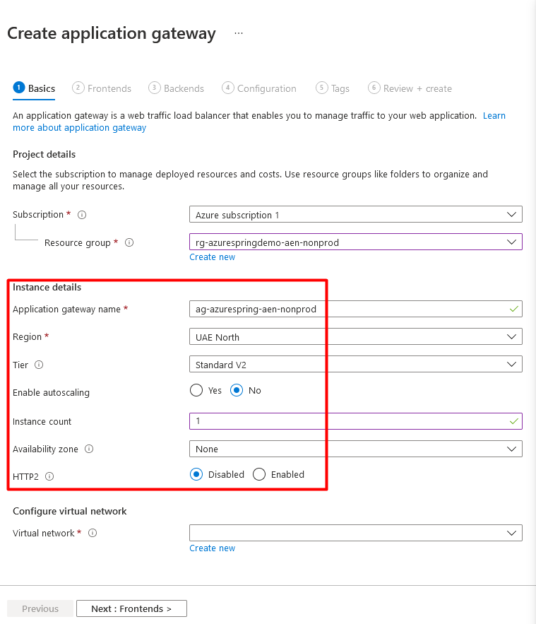
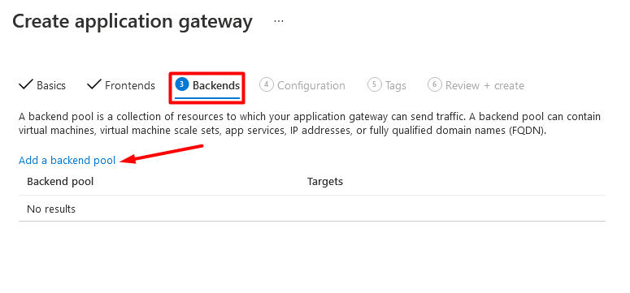
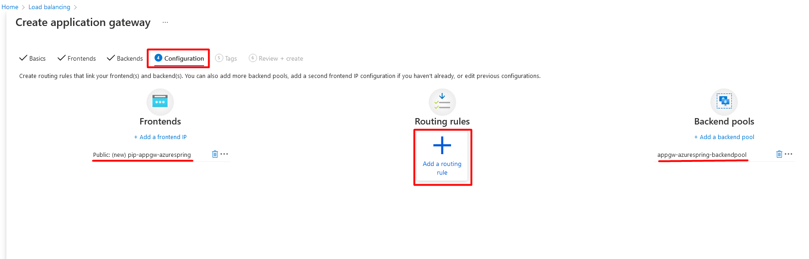
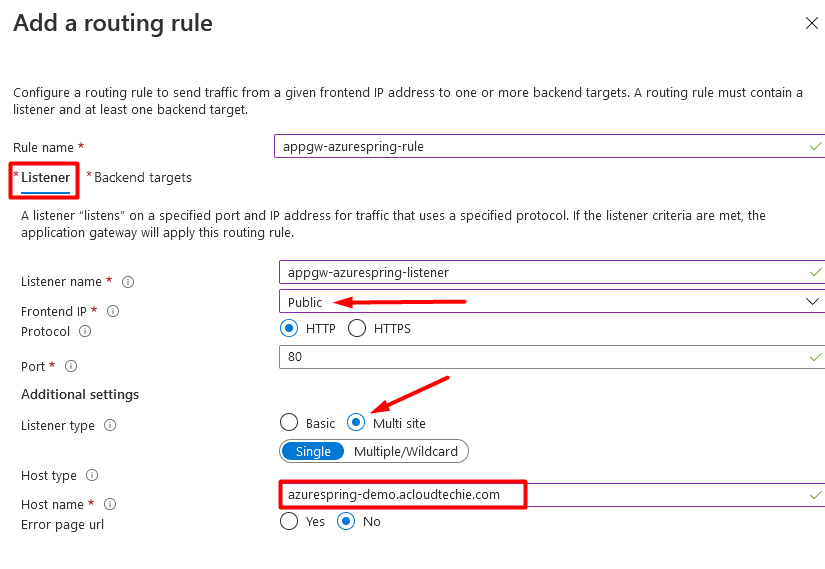
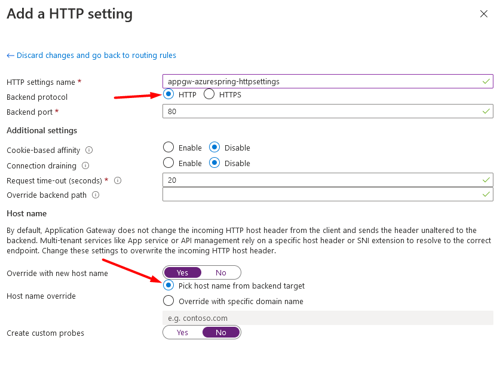
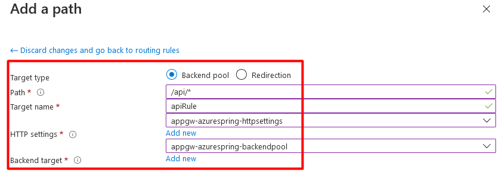

## Application Gateway with single Backend pool, routing rule, Listener and HTTP Settings.

1. Let's start creating **Application Gateway**. Notice the Tier which is set to "Standard V2". For WAF policy to work with Application Gateway, we need to set the Tier as WAF V2

2. Create VNET and Subnet

3. Frontend is the IP address public or private. Every request will receive on frontend and then proceed for further operations.

4. Click on "**Add a backend pool**" to add backend

5. Backend pool is the place where we can configure our backend either it is Virtual machine, App Service (Function / Web App) or Virtual Machine scale set.

6. Next is to add routing rule. Click on + (plus) icon.

7. Configure Listener as shown in Figure 7. This listener will be the entry point for all request coming from Internet. It will listen on **Host name** which is azurespring-demo.acloudtechie.com . Next is to add HTTP Setting.

8. Configure HTTP setting and make sure the radio button "Pick host name from backend target" is selected. Since we've added App Service in backend pool so this HTTP setting will pick the host name of function app which is https://aspw-golangfunc-aen-nonprod.azurewebsites.net in our case.

9. This rule will be based on Path-Based which means here we will define * (wildcard) so it can support all APIs with this URL path. for example:
   - /api/foo
   - /api/bar
   - /api/baroof

10. Our configuration is completed so next is to validate the configurations and all steps.

11. Validate, Review + Create

